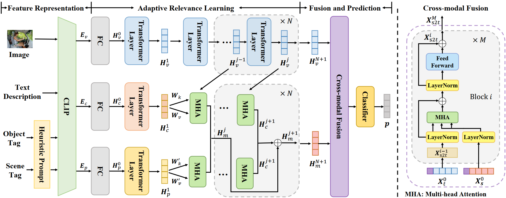
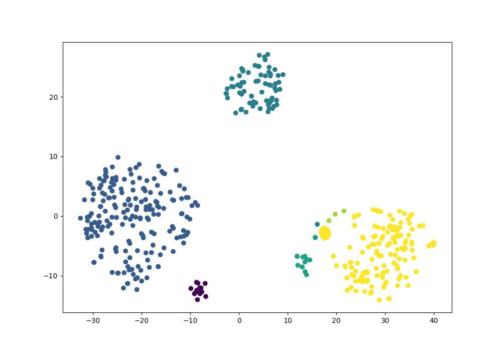
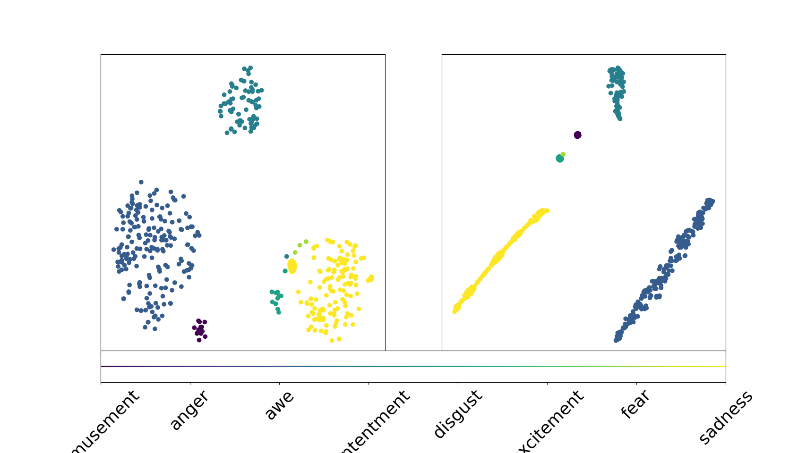

# SentiFormer: Metadata Enhanced Transformer for Image Sentiment Analysis

[//]: # (Pytorch implementation of my model.)

**Framework of SentiFormer**


[Research Paper](https://arxiv.org/abs/2502.15322)
  
## Data Preparation
Download Datasets: please see [metadata-enhanced image sentiment analysis datasets](https://drive.google.com/drive/folders/1d5Qwr7pur6t50p5KgJFk7aLArlFmrdHI).

All the data is publicly available at this link https://drive.google.com/drive/folders/1d5Qwr7pur6t50p5KgJFk7aLArlFmrdHI for research purposes.

## Environment and Dependencies
Our project is built based on Python and Pytorch. 
The version of python used here is python 3.10. In addition, please add the project folder to `PYTHONPATH` and `pip install` the following packages. Install the dependencies in `requirements.txt` and below are some of the main dependencies:
- torch==2.4.0
- torchvision==0.19.0
- torchaudio==2.4.0
- numpy==1.26.4
- networkx==3.3
- tqdm==4.66.4
- GitPython==3.1.43
- requests==2.23.2
- scikit-learn==1.5.1
- transformers==4.44.0
- tqdm==4.66.4
- datasets==2.19.2
- prompt_toolkit==3.0.47
- pytorch-lightning==2.4.0
- psutil==5.9.0
- pillow==10.3.0

We used `pip list --format=freeze > requirements.txt` to export the dependency packages. Others can use the following command `pip install -r requirements.txt` to directly import all the packages from `requirements.txt` into a new environment.
Check that cuda versions match between your pytorch installation and dependency packages.

## Training
First, obtain and standardize the representation of images and metadata, then train the model on the processed data. You can adjust the configuration in `opt.py`. Please run the following command to train the model:

```
python models/sentiformer/train.py --CUDA_VISIBLE_DEVICES 0 --dataPath ./datasets/processed_data_clip.pkl --ARL_depth 4 --fusion_layer_depth 6
```

## Test
Please put the model checkpoint and processed data in the specified path, and run the following command to test the model or perform visualization experiment:

```
python models/sentiformer/train.py --CUDA_VISIBLE_DEVICES 0 --project_name MET_Test --datasetName FI --dataPath ./datasets/processed_data_clip.pkl --test_checkpoint ./checkpoint/best/797.pth --ARL_depth 4 --fusion_layer_depth 6
python visualize.py --CUDA_VISIBLE_DEVICES 0 --project_name MET_Test --datasetName FI --dataPath ./datasets/processed_data_clip.pkl --test_checkpoint ./checkpoint/best/797.pth --ARL_depth 4 --fusion_layer_depth 6
```


## For last training: 
Best Performance was achieved at **epoch 8** with excellent metrics:

**Accuracy**: 99.31% - This means 99.31% of all predictions were correct

**Precision**: 98.69% - Of all the times the model predicted a particular emotion, it was right 98.69% of the time

**Recall**: 99.31% - Of all the actual instances of each emotion, the model correctly identified 99.31% of them

**F1-score**: 98.98% - This is the harmonic mean of precision and recall, indicating very balanced performance

**AUC-ROC**: 0.0 - This is showing as 0 because we modified the metrics to handle the single-class case, it can be ignored


## For the last testing: 
Best Performance was achieved at **epoch 9**

## Visualizer Results:




